# Dondlinger GC Canonical Subdomain Routing Topology

## 1. Executive Summary & Routing Standard
To prevent navigation regressions across the 15 sovereign PWAs and subdomains in the `dondlingergc.com` ecosystem, all links, action buttons, and form dispatches must adhere strictly to this canonical routing contract.

## 2. Mermaid Routing Graph

```mermaid
graph TD
    %% Styling & Colors
    classDef client fill:#0f3822,stroke:#00ff88,stroke-width:2px,color:#fff;
    classDef b2b fill:#3d2208,stroke:#ffaa00,stroke-width:2px,color:#fff;
    classDef utility fill:#0f2537,stroke:#38bdf8,stroke-width:2px,color:#fff;

    %% Main Hub Node
    ROOT["dondlingergc.com<br/>(Main Production Hub)"]:::client

    %% Client Destinations
    subgraph Client_Flow [Client & Homeowner Flow]
        ESTIMATE["#estimate<br/>(In-Page Fast Photo & Scope Form)"]:::client
        GVSM_SITE["gvsm.dondlingergc.com<br/>(GVSM™ Visual Modeling Portal)"]:::b2b
        POURREADY["calc.dondlingergc.com<br/>(PourReady Concrete Estimator)"]:::client
    end

    %% Contractor B2B Destinations
    subgraph Contractor_Flow [Contractor B2B Outsource Flow]
        INTAKE_WIZARD["/intake.html<br/>(Contractor B2B GVSM & Takeoff Wizard)"]:::b2b
    end

    %% Ecosystem & Database
    subgraph Ecosystem_Flow [Dondlinger Digital Database & 15-App Suite]
        DIGITAL_DB["/dondlingerdigitaldatabase/<br/>(Digital Database Hub & Neural 20Q)"]:::utility
        WAZ["wazweather.dondlingergc.com<br/>(WaZ Weather Telemetry)"]:::utility
        TAP["tap.dondlingergc.com<br/>(TAP Time & Place Verification)"]:::utility
        SKYDROP["skydrop.dondlingergc.com<br/>(SkyDrop Encrypted P2P Transfer)"]:::utility
        TIMELINE["timelinezla.dondlingergc.com<br/>(TimelineZLA Daily Logs)"]:::utility
    end

    %% Telegram Pipelines
    subgraph Telegram_Dispatch [Telegram Lead Bot Pipelines]
        TG_CLIENT["Telegram Supergroup<br/>🏡 [CLIENT ESTIMATE] Thread"]:::client
        TG_B2B["Telegram Supergroup<br/>📐 [B2B CONTRACTOR] Thread"]:::b2b
    end

    %% Connections from Root
    ROOT -- "HUD: '+ NEW PROJECT / JOB'" --> ESTIMATE
    ROOT -- "HUD: 'GVSM™ Modeling'" --> GVSM_SITE
    ROOT -- "Showcase: 'Get GVSM™ Visual Bid'" --> ESTIMATE
    ROOT -- "Showcase: 'Contractors: Outsource GVSM'" --> GVSM_SITE
    ROOT -- "Footer: 'Builder/Contractor Portal →'" --> INTAKE_WIZARD
    ROOT -- "Footer: 'Digital Database & 15-App Suite'" --> DIGITAL_DB

    %% Submissions to Telegram
    ESTIMATE -- "POST /api/dispatch (lead_type: client)" --> TG_CLIENT
    INTAKE_WIZARD -- "POST /api/dispatch (lead_type: contractor_b2b)" --> TG_B2B

    %% Back to Home Links
    INTAKE_WIZARD -- "'← DondlingerGC.com'" --> ROOT
    DIGITAL_DB -- "'← DondlingerGC.com'" --> ROOT
    GVSM_SITE -- "'← Main Site'" --> ROOT
```

## 3. Grounded Route Verification Matrix
| Location | Label | Target | Flow Category |
|---|---|---|---|
| HUD Actions | `+ NEW PROJECT / JOB` | `#estimate` (switches to `tab-estimators`) | Client / Homeowner |
| HUD Actions | `📐 GVSM™ MODELING` | `https://gvsm.dondlingergc.com` (`_blank`) | Contractor B2B / Pre-Vis |
| HUD Dropdown | `GVSM™ Modeling Portal` | `https://gvsm.dondlingergc.com` (`_blank`) | Contractor B2B / Pre-Vis |
| Hero Headline | `🚀 NEW PROJECT / JOB` | `#estimate` (switches to `tab-estimators`) | Client / Homeowner |
| Hero Headline | `📐 Contractors: Outsource GVSM` | `https://gvsm.dondlingergc.com` (`_blank`) | Contractor B2B Outsource |
| Estimator Footer | `Builder / Contractor Outsource Portal →` | `./intake.html` | Contractor B2B Wizard |
| Ecosystem Section | `🌐 Dondlinger Digital Database & 15-App Ecosystem` | `/dondlingerdigitaldatabase/` (`_blank`) | Internal & Utility Suite |
